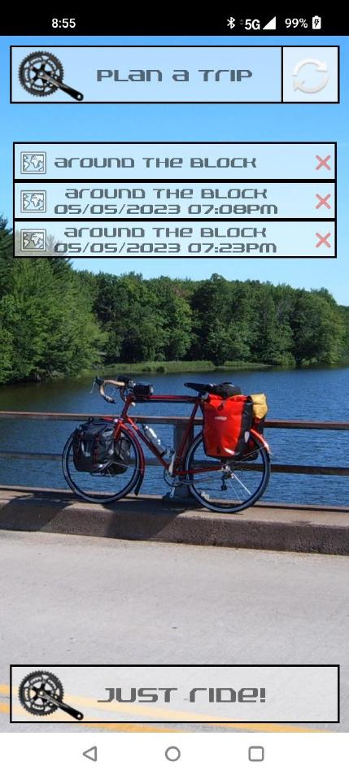

# Bike Touring App



## Motivation

Bike touring is a type of travel by bicycle, typically on less traveled or unpaved roads. Bike 
touring can be supported, where typically a vehicle with travel equipment follows the rider, or
unsupported, where the rider carries all of their own travel equipment. Unsupported touring
typically involves camping overnight and has an element of unpredictability and requires
advanced planning and preparedness. A bike touring app could help with such long distance
and multi-day bicycle trips.

## Touring App

The main purpose of the app is to help with route planning as well as GPS navigation,
monitoring weather and real-time speed/distance information. At the same time the app can
be used a advanced bike computer without requiring any route pre-planning.

## Starting the app

The first time the app is started the user will be presented with the
permission screen to allow precise location. Note, the user must grant
the precise location for more exact speed and distance reporting. The
app cannot proceed until Precise location permission has been granted.

## Trip Listing Screen

This is the initial screen that greets the user. On this
screen the user is presented with several controls:

- Plan A Trip

Click this control to start planning a route.

- Refresh

Click this control to refresh the list of planned and
started/completed trips

- List of planned and completed trips

This displays the list of planned trips (they will
not have a start date below the name) and
started/completed trips (which have a trip
name with the start date/time). The planned
trips act like a template, while the started trips
are instances of the planned trip that have been
started and possibly completed. A planned trip
can be anything from a segment of a multi-day tour, a daily commute, or a one-time ride. A light
tap on the planned trip switches into the ride mode with the selected trip plan. Light tap on the
started trip is meant to allow the user to review the trip progress and potentially resume the trip
(however this functionality is currently incomplete). A red icon deletes the entry from the
phone storage.

A long click on the planned trip entry transitions into trip planning screen.

- Just ride! control switches the app into the ride dashboard mode without any pre-planned route

## Trip Planning Screen

On this screen the user has the ability to plan the route. At
the very top is the trip name control allowing the user to
assign a trip name:

The button transitions to the ride dashboard with
the planned trip. Note: the trip plan is automatically saved
to the phone storage.

Below that is a list of waypoints (segments) that comprise
the trip. For each waypoint the distance from the previous
waypoint and the total distance from the starting point are
listed.

At the bottom is the map view which allows adding new
waypoints. The map can be dragged around and zoomed-
in/out to reposition it. A long-click will add a new waypoint
and automatically create a bicycle-friendly route from the
previous waypoint.

Unimplemented functionality could be to insert intermediate waypoints and deleted waypoints.

Navigating back would save the planned trip and add an entry to the trip listing screen.

A video demonstrating the trip planning functionality can be found here:

https://drive.google.com/file/d/1hRi5NYC8OiAsVfzJoLjxYji8TVjlsZ9G/view?usp=share_link

## Ride Dashboard Screen

On this screen the user is presented with real-time ride
information as well as weather forecast information.

The first line lists today’s date and the display units.
Changing the units via user preferences is a planned
functionality that is currently not implemented.

Next is the current speed (in red) and relative wind
directions.

Relative wind direction takes into account the
actual wind direction from the current weather report
and the direction (bearing) of the rider motion. For
example, if the wind direction is from the north, and the
rider is heading north, the arrow will point down to
indicate headwind. If the wind direction is north and the
rider is heading east, the arrow would point right to
indicate a side wind from the left.

The color of the arrow indicates the wind speed. Green
is mild, yellow/orange is medium and red is strong.

Under the speed is the average and max speed. The
average speed is computed only during the motion of
the bicycle; it excludes the stops.

Next is the current temperature and “feels like”
temperature and current wind/gust speed with actual
wind direction.

The next section has the following fields

- Ride distance: the cumulative travel distance so
    far this trip
- Trip distance: total planned travel distance
- Trip start: the time when the ride began
- Ride time: the cumulative riding time so far
- Trip time: estimated riding time left on this trip (excluding stops), assuming the average speed
- Eta: estimated time of arrival to the destination (including stops). This value uses the overall
    average speed since the trip start time, to estimate the time the rider will reach the destination.

Note that the trip is assumed to start and end on the same day. The functionality to cross over midnight
into the next day is not implemented.


The next section shows the weather forecast information for the next several hours: weather conditions,
wind direction and speed temperature and “feels like” temperature and humidity. This information can
be useful in estimating e.g. how much sun screen needs to be applied and how much water the trip will
require. Note that this information is relative to the current location of the rider and is updated
continuously. Unimplemented future enhancement would try to predict the location of the rider at the
time in question and show the forecast at the estimated location of the rider. This would be especially
useful for the wind direction: instead of the absolute wind direction to display relative wind direction
considering the predominant direction of travel at the time/location.

At the bottom of the screen the map is shown with the planned route in
green and the actual route taken in red. Additionally, show my location
and zoom controls are present.

A video discussing the dashboard layout and functionality can be found
here:

https://drive.google.com/file/d/1SMrEhY0paOzk3KbeavBk1dmc__mWZhVl/view?usp=share_link

## Just Ride Mode

In Just Ride mode, the dashboard screen is identical, except the following fields are not used:

Trip Distance, Trip Time, ETA

A video demonstrating the dashboard functionality while riding can be found here
https://drive.google.com/file/d/1Sn1_wiPtzp6lAbgIFJPXu9moUQupOK7O/view?usp=share_link


## Technical Design/Implementation

The application is written in Kotlin and Java for Android platform. The following shows the UML class
diagram of the application:

All state updates are handled using the 3 ViewModels. WeatherAPI client is using the remote REST type
WeatherAPI service. RoutesClient uses google Routes API and implements GRPC communication for
better performance. The client uses a cached channel (connection) to improve performance as well. All
map functionality is implemented using the google Maps API via a built-in android
com.google.android.gms.maps.SupportMapFragment. This includes zoom and find my location, but does
not include route plotting, which is handled separately via state updates. Location service is
implemented via android built-in com.google.android.gms.location.FusedLocationProviderClient.Google


Maps and Routes APIs require a paid subscription, although there is enough allowance for occasional
usage to offset actual charges. WeatherAPI service has a free subscription model for basic usage.

_Other major design decisions_

- One major usability decision was to minimize user interaction with the UI during the ride to
    prevent distraction as well as automate some of the tasks. For example, the dashboard will
    automatically detect motion of the bicycle when 2 consecutive location updates indicate speed
    above a certain threshold. Likewise the dashboard will auto-pause when speed drop below the
    threshold or there has been no location updates in 30 seconds.
- Dashboard updates. Initially I designed dashboard state updates around the location updates.
    But this meant that if the location updates are not available, the dashboard “freezes”. Instead, I
    implemented 2 asynchronous tasks in the DashboardViewModel: one for monitoring the
    location updates and populating the state information accordingly, and another to request
    periodic weather updates.

## Limitations, Unimplemented Features and Future Direction

Due to limited time, some major planned functionality was not implemented:

- Altitude display during planning and ride stages
- Better route planning functionality: ability to insert and delete waypoints
- Functionality around managing trip interruption. E.g. if the app is restarted, the rider should be
    able to resume the trip, potentially from a new location.
- Automatic re-routing. If the rider had to take an unexpected detour, the app should help with
    re-routing the trip.
- Better error handling. Due to tome constraints error handing is minimal. Many error conditions
    either have not been tested or not handled well.
- Associating media with routes. During the tour it would be nice to tag photos/videos taken
    during the trip with location on the map. When reviewing the route taken, such photos/videos
    could be shown on the map as markers.
- Ability to save detailed ride information, such as weather conditions and speed, along with the
    actual travel route. This information could be also useful in planning future tours.
- Synchronizing locally stored trips with an external storage repository in case the phone is
    broken/lost.

```
Let’s Ride!
```

